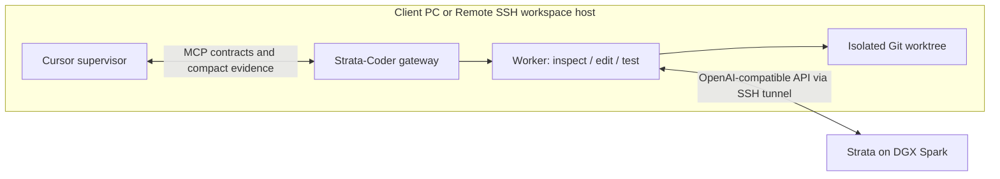

> v0.3 adds decision-only supervision: bounded briefs in, compact directives out; Strata handles execution and verification. [Setup (日本語)](docs/decision-mode-ja.md). Token gates are staged: Step 1 <=10%, Step 2 <=2%, Step 3 <=1%. None is a verified claim until measured. Legacy worker MCP is opt-in.

# Strata-Coder

Cursor supervises. Strata does the bulk of repository research, implementation and test iteration.

Strata-Coder is a Cursor extension, MCP gateway and local coding worker in one repository. It connects to an existing Strata inference server, including one on a DGX Spark reached through SSH. The model weights and Strata engine are **not** bundled.

**Status: v0.2 development (not published yet).** Linux worker execution is tested. Cursor API integration is implemented and tested with mocks, but needs an installed-Cursor acceptance test. Windows/macOS and Remote SSH host behavior need validation. No measured token-saving or quality claims yet.

For step-by-step installation in Japanese, start with [はじめての導入ガイド](docs/quickstart-ja.md).

For variable numbers of Cursor Agents, see [queued-mode startup](docs/multi-agent-setup-ja.md) and [test instructions](docs/test-prompts-ja.md). The default `single` mode preserves the original behavior; choose `queued` explicitly.

## Architecture



Cursor retains task decomposition, design decisions and patch review. The worker returns a small summary and evidence IDs, rather than flooding Cursor with full source and logs. Full patch/test evidence is fetched in bounded pages. Model execution occurs on Spark; file operations and tests occur on the workspace host. A local GPU is not required for this worker.

## Requirements

- Cursor with `vscode.cursor.mcp.registerServer`; plugin registration additionally uses `vscode.cursor.plugins.registerPath`.
- Python 3.10+, Git, and an SSH client on the **workspace host**. No pip dependencies.
- A trusted, clean Git repository with at least one commit. Commit/stash existing changes yourself. Submodules are unsupported.
- An existing Strata server exposing `/v1/models` and `/v1/chat/completions` with tool calls.

With Cursor Remote SSH, the extension is a workspace extension: Python, Git, SSH aliases, the worktree and test commands must exist on the remote workspace host. The machine running the Cursor window is not necessarily the workspace host.

## Install in Cursor

Download/build `strata-coder-0.2.0.vsix`, then run **Extensions: Install from VSIX** in Cursor. Open your Git root as a trusted workspace. The extension registers a separate MCP server per workspace folder and the bundled `strata-coder` supervisor skill. It does not change your model selection.

Configure User/Remote settings (these settings intentionally cannot be overridden by an untrusted repository):

```json
{
  "strataCoder.connectionMode": "ssh",
  "strataCoder.sshHost": "gdx-spark",
  "strataCoder.remotePort": 8080,
  "strataCoder.model": "",
  "strataCoder.pythonPath": "python3",
  "strataCoder.testCommands": {
    "unit": ["python3", "-m", "unittest", "discover", "-s", "tests"]
  }
}
```

An empty model selects the single model returned by `/v1/models`. Use **Strata-Coder: Set API Key** when Strata requires authentication; the extension stores it in VS Code SecretStorage. Do not put credentials in this repository.

Run **Strata-Coder: Check Connection**, then **Strata-Coder: Register / Reconnect** after changing configuration. Reconnect only when tasks are idle; it can interrupt workers. In Agent chat:

> Use Strata-Coder to investigate this bug. You decide the implementation plan and review the patch. Delegate bulk reading and local test iteration to Strata.

For a specific edit:

> Use Strata-Coder to fix the boundary error in src/parser.py. Only edit that file and tests/test_parser.py. Require the unit tests to pass, then review the entire patch before applying it.

This uses Cursor's **normal Agent chat via MCP tools**, not a custom `@Strata-Coder` chat participant. The supervisor remains a Cursor model and consumes tokens. Extension installation does not force every task to use Strata: the supplied skill guides delegation.

## SSH: automatic tunnel

On the workspace host, put the real host in your SSH configuration:

```sshconfig
Host gdx-spark
    HostName YOUR_SPARK_IP
    User YOUR_USER
    IdentityFile ~/.ssh/YOUR_EXISTING_KEY
```

Authenticate and verify the host key with normal `ssh gdx-spark` first. Confirm `ssh -o BatchMode=yes gdx-spark true` succeeds. The extension uses your existing key/SSH agent, a random loopback port, strict host-key checking and `ExitOnForwardFailure`. It never asks for, saves or embeds an SSH password. The destination is Spark's `127.0.0.1:8080`; Strata can remain bound to loopback.

Strata-Coder closes only its own SSH process. If it dies, the next API request can reopen a tunnel. A request interrupted by network loss fails rather than replaying tool operations automatically.

## SSH: password login or an existing tunnel

Open a terminal on the workspace host and keep this command running:

```sh
ssh -N -T -o ExitOnForwardFailure=yes -L 127.0.0.1:18080:127.0.0.1:8080 gdx-spark
```

Enter the SSH password **in that terminal**. Then use:

```json
{
  "strataCoder.connectionMode": "direct",
  "strataCoder.baseUrl": "http://127.0.0.1:18080/v1"
}
```

This supports password-based SSH without exposing credentials to the extension. A remote direct API instead requires HTTPS and an API key. The client refuses HTTP to non-loopback hosts and does not follow HTTP redirects or use ambient proxies.

## Manual MCP setup

If the Cursor version does not expose the extension API, configure MCP manually with absolute paths. This example uses a checkout of this repository:

```json
{
  "mcpServers": {
    "strata-coder": {
      "command": "python3",
      "args": ["/absolute/strata-coder/tools/gateway.py", "--repo", "/absolute/project", "--state", "/absolute/strata-coder-state/project"],
      "env": {"STRATA_CODER_CONFIG": "{\"mode\":\"ssh\",\"ssh_host\":\"gdx-spark\",\"remote_port\":8080}"}
    }
  }
}
```

The state directory must be outside the target repository. Install the bundled skill separately using Cursor's skill mechanism, or explicitly ask Cursor to follow it. Do not register the same workspace twice.

## Tools and review workflow

- `strata_health`: endpoint and available test IDs.
- `strata_submit`: research or edit contract; returns a task ID immediately. queued mode requires request_key and should use a stable owner label.
- `strata_summary`: bounded summary and evidence IDs; optional wait up to 20 seconds.
- `strata_evidence`: patch/log pages (4,000 characters default, 12,000 maximum).
- `strata_cancel`: stop future actions and terminate a running test process tree.
- `strata_apply`: apply a patch after Cursor reviews it and passes the exact patch hash. queued mode returns apply_queued first, not applied.

`review_ready` means **awaiting supervisor review**, not proven correctness. Final contract tests are rerun after editing. Any failure blocks apply. No tests configured means no tests verified. Cursor must inspect acceptance criteria and patch contents; the hash is a consistency check, not cryptographic proof that a human reviewed anything.

In single mode only a clean, unchanged destination accepts a patch. In queued mode apply is serialized; a clean changed base is reapplied and tested in a new worktree, then returned for review with a base-bound patch hash. A dirty destination is preserved and returned for supervision. Applying changes leaves them uncommitted. Strata-Coder does not commit, push or deploy. A cancellation cannot immediately abort an in-flight nonstreaming model request; it settles when the response/timeout arrives (90 seconds by default), and no subsequent tool calls run.

## Scope and limitations

- In `single` mode, one active worker per workspace. In `queued` mode, a shared SQLite coordinator accepts tasks from a variable number of Agents with configurable queue capacity, per-owner limits, global Worker limit and a separate inference limit. Local Worker/test slots are configurable per workspace. All clients must use the same coordinator; direct requests from other apps bypass it.
- Default 12 inference steps (max 30), context and output caps, soft task deadline (default 600s), bounded test runtime/output. A request already in flight can extend beyond the soft deadline.
- Research can read/search only. Edits are restricted to supervisor-specified path patterns. Secrets by common path names, `.git`, symlinks and instruction edits are blocked. This is not a comprehensive secret detector.
- Tests are exact operator-configured argv arrays, with no model-supplied shell commands. They **execute repository code with user privileges**. Git worktrees are change isolation, **not an OS sandbox**. Use trusted repositories; use a container/VM for hostile code. The worker does not read your shell environment's API secrets into tests, but this is not an OS security boundary.
- Checkpoints, transcripts, worktrees and evidence are stored locally in extension storage and may contain source code. They are not checked into this repository. Review your data retention requirements.
- Completed worktrees are retained for inspection. There is no automatic cleanup, transparent replay, or `revise_task`. queued tasks survive coordinator restart; running tasks with uncertain outcomes become interrupted. In-flight inference failures pause admission, and uncertain applies quarantine that workspace until operator inspection. After restart unfinished tasks appear interrupted. Start a new task from the original base with concise corrections; do not assume the earlier patch is inherited.
- Worker inference usage is measured. Cursor usage is not accessible through the implemented extension API; measure Cursor-side totals separately. API compatibility alone does not guarantee good coding quality.

## Development

```sh
python3 -m unittest discover -s tests -v
node --check extension/extension.js
node tests/extension.test.js
npx --yes @vscode/vsce package --no-dependencies
```

Tests use temporary Git repos and a loopback HTTP server. The extension has no npm runtime dependencies. See [architecture](docs/architecture.md), [evaluation protocol](docs/evaluation.md), and [Japanese quickstart](docs/quickstart-ja.md), and [verification record](docs/verification.md).

## License

MIT. Strata and model licenses are separate; no engine/model code is copied here.
