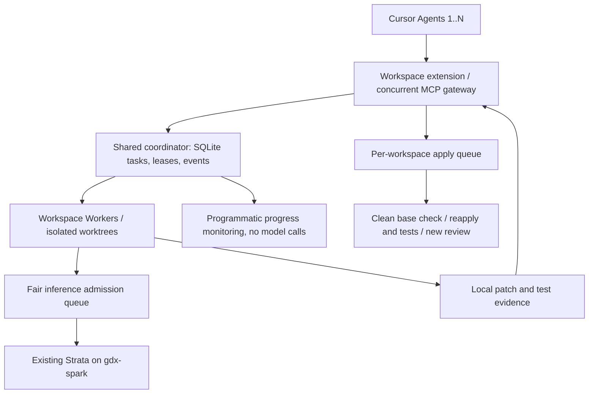

# Variable-agent supervisor / worker architecture (v0.2 development)

Cursor Agents retain design and quality decisions. No fixed Agent count is assumed. Task queue capacity, admitted Worker count, per-workspace Worker/test slots and upstream inference slots are independent settings. Agent labels are fairness metadata, not credentials.

## Placement and persistence

The coordinator runs on Spark loopback behind SSH and is the single admission gate for the configured Strata. Workspaces pull only their tasks. SQLite stores contracts, states, fencing leases, compact results and event cursors. Source transcripts/full test logs and worktrees stay on the workspace host; selected inference context crosses to Spark. API secrets remain outside Git.

The coordinator is a single-user trust domain: all token holders can administer it. workspace hashes route jobs but do not provide strong tenant isolation. Run exactly one coordinator for an inference backend. Other apps bypassing its proxy are outside its concurrency accounting.

Submission uses (workspace, owner, request_key) and a fingerprint including base SHA. Duplicate identical requests reuse the task; changed payloads with reused keys are rejected. The queue applies capacity/backpressure and least-recently-served owner rotation among available workspaces, then FIFO within an owner. Inference uses its own owner rotation. This is fairness, not a latency SLA.

## Failure model

- Queued tasks survive restart. A running task whose lease expires becomes interrupted, not requeued. A stale lease cannot publish completion.
- A coordinator restart interrupts active tasks. If inference was in flight, admission is paused because the upstream may still be computing.
- Inference HTTP failures with uncertain completion also pause admission. An operator verifies upstream idle before reset. Model context errors currently take this conservative recovery path too.
- An interrupted apply quarantines further applies for the workspace. Human inspection is required before reset; no blind patch replay.
- Requesting cancellation stops queued work immediately. Active work stops at safe boundaries; an already-running nonstreaming inference may settle only at its response/timeout.

## Review and integration

Workers produce compact reports, full patch evidence and independently recorded final test results. Cursor reviews the full patch and relevant test evidence. Apply requests queue separately from Worker jobs. If the original repo is dirty, preserve it and return for supervision. If its committed base changed, try the patch in a new isolated worktree, rerun contract tests and request a new review. Patches contain a base-SHA header so identical code changes against different bases get different review hashes. Conflicts never silently trigger model rewriting.

Apply leaves uncommitted changes. There is no automatic commit, stash, branch merge or push; integrating a second patch may therefore require the supervisor/user to handle the first change before proceeding. Retained worktrees need manual retention management.

## Token accounting and notification limits

The extension reads local event snapshots and displays recent task states without invoking a model. The MCP gateway handles multiple requests concurrently, so one bounded summary wait does not block all submissions. It caps outstanding RPCs; it does not promise unlimited transport capacity. Completion notifications do not automatically resume a Cursor Agent. If its MCP call already returned, a user follow-up may be needed.

Compare Cursor-only against the same N Cursor Agents delegating to Strata, including instructions, summaries, evidence, polling, retries and takeover. Strata usage is separate. Synthetic load tests measure queue/admission invariants, not coding quality or Cursor token savings.
