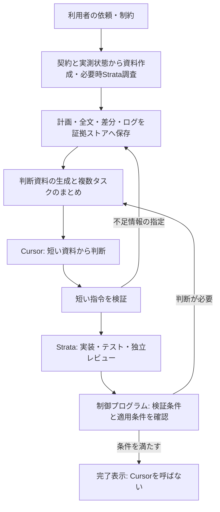

# Cursorへの入出力を削減するアーキテクチャ

**段階目標：Step 1＝1/10以下（10%）、Step 2＝1/50以下（2%）、Step 3＝1/100以下（1%）。現在はStep 1を実装・検証中です。品質を維持した実測で合格してから次へ進みます。**


更新日：2026-10-09。最終目標：同一課題・同一品質条件で、Cursor総トークンを単独実行の **1%以下** にする。現在の合格条件はStep 1の10%以下。

**状態：v0.3で判断バッチ・短い指令・ローカル進行・独立レビューを実装。1/100達成は未確認。** 初期実装の手順と制約は[decision方式](decision-mode-ja.md)を参照。旧実装は[旧構成](architecture-v0.2.md)を参照。評価途中で増加が確認されたため、旧構成の追加実行を停止した。以下を実装・再評価するまでは削減成功と扱わない。

## 1. 役割を変える

Cursorは判断を担当する。Strata-Coderは作業の進行を担当する。Cursorにファイル探索、タスク分割の詳細化、状態取得、テストログ回収、差分の逐次取得をさせない。

短い依頼では利用者の原文とプログラムで確認したrepo状態から判断資料を作る。長い依頼や追加調査ではStrataが要約・調査する。実行契約と証拠はローカルの状態ストアへ保存する。ローカルの制御プログラムが、依存関係・実行枠・テスト・再試行・完了表示を進める。判断が必要な局面だけCursorを呼ぶ。



## 2. Cursorへの入力

通常は次の4項目と識別情報だけを送る。内容はStrataが作り、制御プログラムが長さ・必須項目・証拠参照を検査する。

```json
{
  "id": "decision-17",
  "revision": 2,
  "background": "ページ分割関数。呼出元は2箇所。",
  "purpose": "入力を欠落なく分割する。",
  "current": "末尾欠落を再現。計画P17、対象1ファイル。",
  "request": "P17の実行可否と深度を指定。仕様不明点なし。"
}
```

- 会話履歴・全コード・全ログ・長いWorker報告を繰り返し渡さない。
- 計画・受入条件・証拠はID参照。改訂時には変更点を渡す。
- 失敗、未検証、仕様の曖昧さ、範囲拡張、副作用、競合は必須情報とする。長さを超えても黙って切り落とさない。資料の作り直し・分割・保留へ送る。
- 必要なときだけ、Cursorが指定した質問に対する根拠箇所を追加する。追加取得もトークン予算へ含める。
- 開発上の初期上限は4項目合計800文字。文字数制限は通信量を抑える手段であり、正確なトークン数や1/100達成の証拠ではない。

## 3. Cursorの出力

通常は説明文を生成させず、短い構造化指令だけを受け取る。

```json
{"id":"decision-17","revision":2,"action":"run","plan":"P17","depth":"low"}
```

指令はrun（計画実行）、revise（計画修正）、inspect（根拠の追加調査）、stop（停止）の4種。revise／inspectには短い具体的要求を付ける。初期出力上限は1判断240文字。詳しいコード、契約、テストコマンドはCursorに再生成させず、保存済みの計画を参照する。未知ID、古いrevision、契約範囲の拡張、不正な出力は実行せず記録する。

明示されたlow／medium／highは優先し、autoの場合だけCursorが深度を選ぶ。通常完了時の長文報告はStrataとUIで作成し、Cursorの追加生成を必要としない。

## 4. 呼び出し回数も減らす

入力文字数だけを減らしてもCursorの固定コンテキストと推論呼出しの負担は残る。判断依頼をキューに集め、独立した複数タスクを1回で判断できるようにする。タスク数Nと判断バッチ数を分離する。期限を持ち、重要な阻害要因は無期限に待たせない。

独立したCursor ChatをN個立ち上げることを必須にしない。計画・作業は可変数のStrata Workerへ振り分け、Cursorへの判断要求を集約する。既存のChatから依頼する場合も、そのChatで使った初期トークンを評価に含める。都合のよい部分だけを切り出して1/100と称しない。

実行中の定期確認、固定回数の再試行、最終テストはプログラムで実施する。正常に進んでいる間はCursorを呼ばない。Cursorへ戻すのは、仕様判断、計画変更、範囲外変更、検証失敗、独立レビューの不一致など。

## 5. 品質を落とさないための制御

短い要約だけでコードの正しさは保証できない。実装担当と別コンテキストのStrataレビュー、仕様に対応したテスト、変更範囲検査、基準SHAと差分ハッシュ検証を必須にする。レビュー結果を自己申告だけで成功扱いしない。

Cursorが事前に認めた計画と適用条件に一致する低リスクの変更だけ、制御プログラムが適用する。失敗・未検証・仕様不明・競合などは停止または再判断に送る。これは旧v0.2の「Cursorが毎回全差分を読む」方式からの変更であり、適用条件と品質評価を実装するまでは既存のレビュー要件を外さない。

## 6. 段階ごとの上限を合格条件にする

- 比較対象は同じ課題集合・Cursorモデル・品質判定。単独実行の総トークンをBとし、併用の上限をStep 1では0.10B、Step 2では0.02B、Step 3では0.01Bとする。
- 総量はCursorの入力＋出力＋キャッシュ読込＋キャッシュ書込。初期指示、判断、追加質問、失敗、引取り、最終応答をすべて含める。Strata使用量は別記する。
- 不完全な実行、測定漏れ、品質低下を除外して見かけの削減率を作らない。必要な品質を保ち、全実行が測定され、比率が選択した段階の上限以下の場合のみ合格。
- 実行前に既知の利用量と残り予算を確認する。ただしCursor CLIには厳密な呼出し単位の総トークン上限を強制できると確認済みの仕組みがない。現段階で保証できるのは、超過後の追加呼出し停止と事後の合否判定であり、超過ゼロの保証ではない。
- 単純な1件の課題では固定入力だけで1%を超える可能性がある。その場合は不合格として扱い、複数課題をまとめた評価と混同しない。

## 7. 実装順序

1. 保存済み計画・証拠IDを持つ4項目の判断資料と、短い指令の契約を実装する。
2. 待機・調査・実装・検証・独立レビューをCursorの外へ移す。
3. 複数タスクの判断バッチと差分のみの再判断を実装する。
4. 事前に許可した適用条件、予算記録、超過時の停止を実装する。
5. 同一課題で再評価し、品質を維持した1%以下を確認する。

この設計書の追加だけでは1/100を達成したことにならない。稼働中のv0.2と新方式を区別して記録する。
