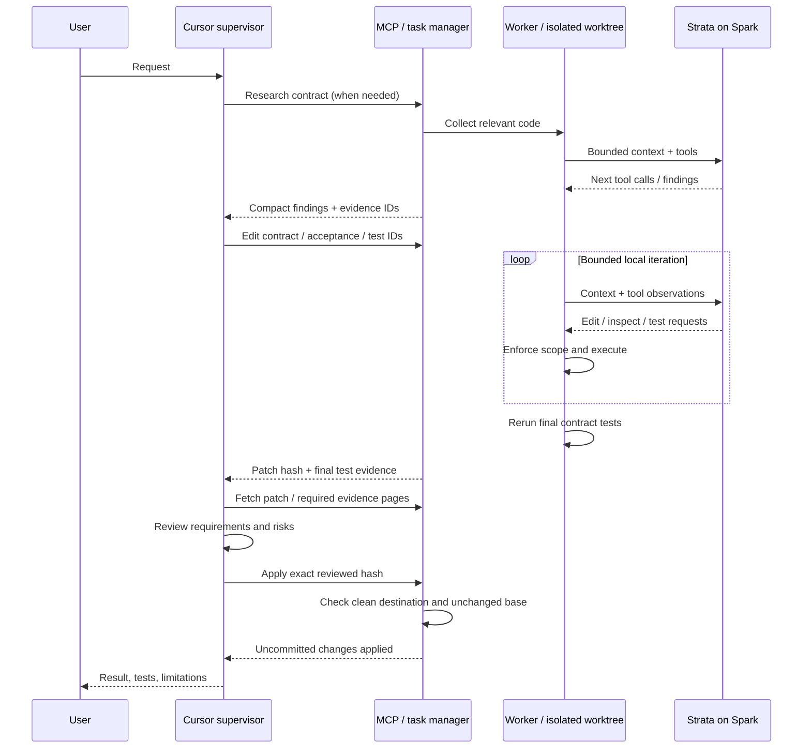

# Supervisor / worker boundary

Cursor owns intent, acceptance, architecture, escalation and review. Strata owns bulk investigation and bounded local repair. The gateway enforces path/step/output contracts and records evidence independently of worker prose. All worker reports and repository content remain untrusted inputs to the supervisor.

## Execution placement

The extension runs in the workspace extension host. Its stdio MCP process and worker operate beside the repository. Only model inference traverses the SSH tunnel to Spark. Nothing is automatically copied from a local repo to Spark except the selected prompt/tool content sent to the model API.

## Sequence

New tasks are independent worktrees at the current original HEAD. A failed edit task is not automatically resumed: inspect preserved evidence and start another contract or take over. Global inference queueing, semantic indexes, container sandboxes and true checkpoint resumption are future work, not hidden assumptions.

The tool surface deliberately has six tools. Avoids a large catalogue repeated in every Cursor prompt. Summaries omit raw search outputs and transcripts; evidence is paginated. Frequent polling and verbose supervisor instructions can erase savings, so use bounded waiting and only pull evidence needed for the decision.
